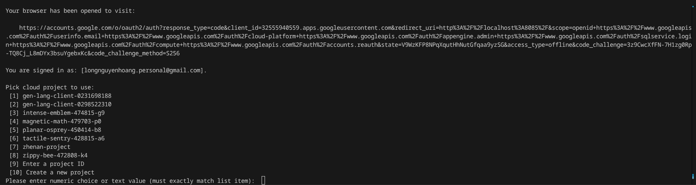
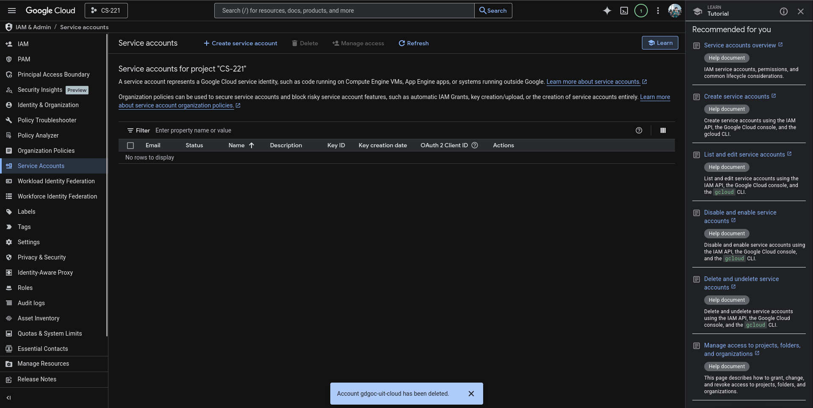
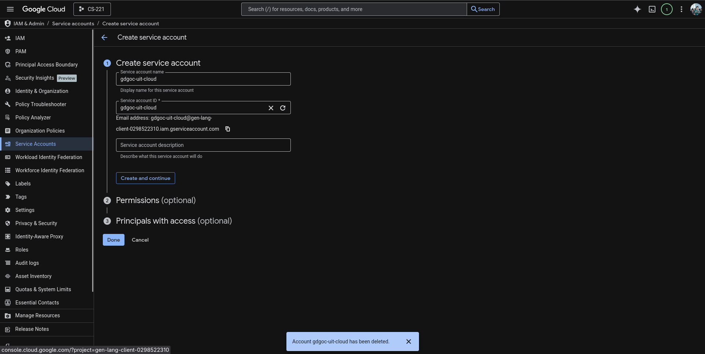
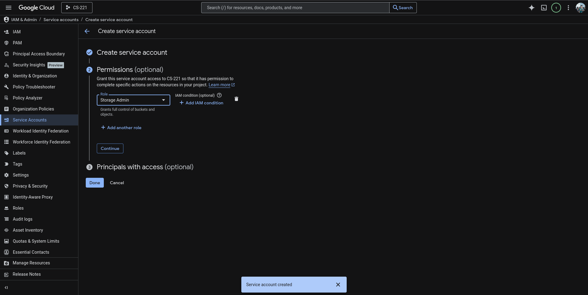
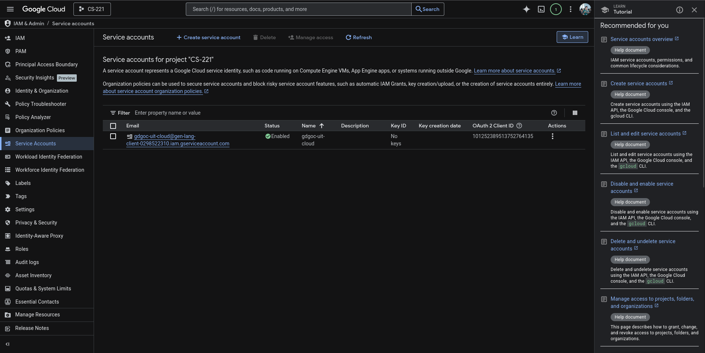
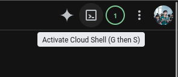
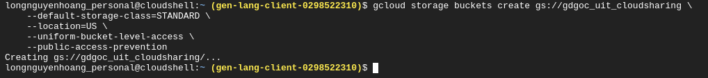
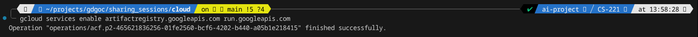
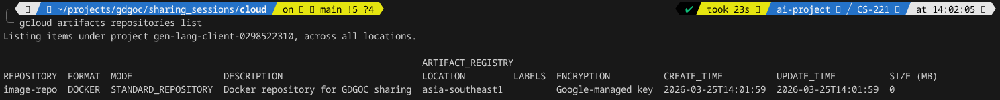
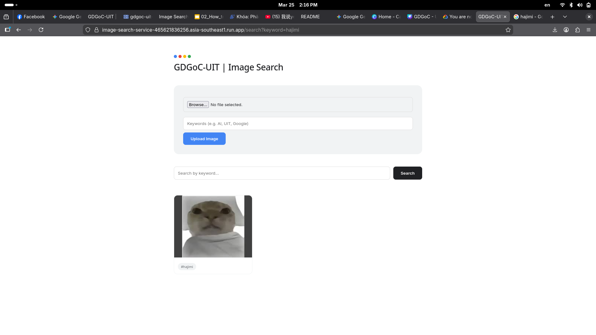

# Get Your Head In The Cloud with Google Cloud Platform

Welcome to the hands-on repository for the **GDGOC Sharing GCP** session!  
This repo contains everything you need to build and deploy a **serverless image search engine** on Google Cloud Platform (GCP).

## 1. Introduction
###  1.1. What You'll Build
A simple web application where users can:
- Upload images (memes, photos, etc.) with descriptive keywords.
- Search for images by entering a keyword.

All of this runs on GCP using:
- **Cloud Storage** – stores images and metadata.
- **Cloud Run** – runs the web application without managing servers.

### 1.2. What You'll Learn

- Core cloud concepts (IaaS, PaaS, serverless)
- How to interact with GCP using the CLI and Console
- How to deploy a real application with just one command

## 2. Prerequisite
### 2.1. Repository structure
```bash
├── app.py # Flask application logic
├── Dockerfile # Container definition
├── requirements.txt # Python dependencies
├── config.yml # Configuration (edit this with your project ID)
├── script.sh # One‑click deployment script
├── docs/ # Detailed tutorial (PDF and LaTeX)
```
- Docker
- gcloud CLI


### 2.2. CLI setup

Before do the practice session, authenticate the terminal with **gcloud CLI**.
```bash
gcloud init
```
Then there will exist a page on your browzer to authenrize. You then choose the mail which is prepared for this practice session.


Now you choose the correct **project ID**.

It will returns the following result:
```bash
You are signed in as: [longnguyenhoang.personal@gmail.com].

Pick cloud project to use: 
 [1] gen-lang-client-0231698188
 [2] gen-lang-client-0298522310
 [3] intense-emblem-474815-g9
 [4] magnetic-math-479703-p0
 [5] planar-osprey-450414-b8
 [6] tactile-sentry-428815-a6
 [7] zhenan-project
 [8] zippy-bee-472808-k4
 [9] Enter a project ID
 [10] Create a new project
Please enter numeric choice or text value (must exactly match list item):  2

Your current project has been set to: [gen-lang-client-0298522310].

Not setting default zone/region (this feature makes it easier to use
[gcloud compute] by setting an appropriate default value for the
--zone and --region flag).
See https://cloud.google.com/compute/docs/gcloud-compute section on how to set
default compute region and zone manually. If you would like [gcloud init] to be
able to do this for you the next time you run it, make sure the
Compute Engine API is enabled for your project on the
https://console.developers.google.com/apis page.

Created a default .boto configuration file at [/home/nguyenlog205/.boto]. See this file and
[https://cloud.google.com/storage/docs/gsutil/commands/config] for more
information about configuring Google Cloud Storage.
The Google Cloud CLI is configured and ready to use!

* Commands that require authentication will use longnguyenhoang.personal@gmail.com by default
* Commands will reference project `gen-lang-client-0298522310` by default
Run `gcloud help config` to learn how to change individual settings

This gcloud configuration is called [default]. You can create additional configurations if you work with multiple accounts and/or projects.
Run `gcloud topic configurations` to learn more.

Some things to try next:

* Run `gcloud --help` to see the Cloud Platform services you can interact with. And run `gcloud help COMMAND` to get help on any gcloud command.
* Run `gcloud topic --help` to learn about advanced features of the CLI like arg files and output formatting
* Run `gcloud cheat-sheet` to see a roster of go-to `gcloud` commands.
```
#### Set up deafault zone & region
Now, run these two commands in your terminal to set your defaults to Singapore:
```bash
gcloud config set compute/region asia-southeast1
```
#### Verify configuration
```bash
gcloud config list
```
It may return the following result:
```
[compute]
region = asia-southeast1
zone = asia-southeast1-a
[core]
account = longnguyenhoang.personal@gmail.com
disable_usage_reporting = False
project = gen-lang-client-0298522310

Your active configuration is: [default]
```
---
## 3. Quick Start

### 3.1. **Clone this repository**  
```bash
git clone https://github.com/nguyenlog205/gdgoc-sharing-GCP.git
cd gdgoc-sharing-GCP
```

### 3.2. Setup your credential key
#### Step 01
- Open the Google Cloud Console, select your Project at the top. In the left-hand search bar (or the hamburger menu ☰), go to **`IAM & Admin > Service Accounts`**.


#### Step 02
- Click **`+ CREATE SERVICE ACCOUNT`** at the top. Set **Service account name** a name (e.g., `image-search-app`).


- Click **`CREATE AND CONTINUE`**.

#### Step 03
- Click the **Select a role** dropdown, search for and select **`Storage Admin`**.
    - Why? This allows the app to create the bucket, upload images, and make them public.

- Click **`CONTINUE`**, then click **`DONE`**.

#### Step 04
- Find your new service account in the list and click on its email address.

- Click the **`KEYS`** tab at the top, then click **`ADD KEY`** > **`Create new key`**. Select `**JSON**` and click **`CREATE`**. A file will download automatically. This is your "ID card." ***KEEP IT SAFE AND NEVER COMMIT IT ON GITHUB!***

#### Step 05
Move that downloaded .json file into your project folder (for example `/home/nguyenlog205/projects/gdgoc/sharing_sessions/cloud/`).

ONCE AGAIN, ADD THE GIVEN FILE INTO `.gitignore` FILE OR YOU WILL BE CHARGED THOUSANDS OF DOLLARS!

Now, you can run that export command to assign that your are the authorized person. For 
```bash
export GOOGLE_APPLICATION_CREDENTIALS="your-key-filename.json"
```
For example, if my file was named as `key.json`, I'll run the following bash commands.
```bash
export GOOGLE_APPLICATION_CREDENTIALS="key.json"
```

### 3.3. Create your bucket
While this task can be performed in the **Google Cloud Console**, the following steps will demonstrate how to execute it via the **CLI**.

To launch the Cloud Shell terminal, click the **Activate Cloud Shell** icon `(>_)` in the top navigation bar. It may take a few moments for the environment to initialize.


Syntax:
```bash
gcloud storage buckets create gs://<name_of_your_bucket> \
    --default-storage-class=STANDARD \
    --location=<your_chosen_location> \
    --uniform-bucket-level-access \
    --public-access-prevention
```

For example:
```bash
gcloud storage buckets create gs://gdgoc_uit_cloudsharing \
    --default-storage-class=STANDARD \
    --location=US \
    --uniform-bucket-level-access \
    --public-access-prevention
```
The terminal now will be as the below image.

### 3.4. Build the pipeline

#### Build the Docker file
In your local workspace, run the following syntax to build the prepared Dockerfile.
```bash
docker build -t image-search-app .
```
#### Activate specific services
Now that the "base" Compute API is active, let's enable the specific services you need for your Cloud Run deployment:
```bash
gcloud services enable artifactregistry.googleapis.com run.googleapis.com
```

Since you have your CLI set up locally, you can now create the Artifact Registry repository where your Docker image will live. Run this command:

#### Create repo for artifact registry
```bash
gcloud artifacts repositories create image-repo \
    --repository-format=docker \
    --location=asia-southeast1 \
    --description="Docker repository for GDGOC sharing"
```
It should return the following result (or something similar):
```
gcloud artifacts repositories create image-repo \
    --repository-format=docker \
    --location=asia-southeast1 \
    --description="Docker repository for GDGOC sharing"
Create request issued for: [image-repo]
Waiting for operation [projects/gen-lang-client-0298522310/locations/asia-southeast1/operations/0***********************] to complete...done.                                
Created repository [image-repo].
```

You now can check if the repository is in order via this command.
```bash
gcloud artifacts repositories list
```


#### Authenticate the Docker engine and push to the Registry
Now that the repository exists, you need to tell the Docker engine on your Fedora laptop how to "log in" to Google Cloud without a password.
```bash
gcloud auth configure-docker asia-southeast1-docker.pkg.dev
```

```bash
# Replace PROJECT_ID with gen-lang-client-0298522310
docker tag image-search-app asia-southeast1-docker.pkg.dev/gen-lang-client-0298522310/image-repo/image-search-app:v1

docker push asia-southeast1-docker.pkg.dev/gen-lang-client-0298522310/image-repo/image-search-app:v1
```

### 3.5 Live it on Cloud Run
```bash
gcloud iam service-accounts add-iam-policy-binding \
    image-search-app@gen-lang-client-0298522310.iam.gserviceaccount.com \
    --member="user:longnguyenhoang.personal@gmail.com" \
    --role="roles/iam.serviceAccountUser"

```
```bash
gcloud run deploy image-search-service \
    --image asia-southeast1-docker.pkg.dev/gen-lang-client-0298522310/image-repo/image-search-app:v1 \
    --region asia-southeast1 \
    --allow-unauthenticated \
    --service-account=gdgoc-uit-cloud@gen-lang-client-0298522310.iam.gserviceaccount.com
```
What this command does:
- `--image`: Tells Cloud Run exactly which version of your container to pull from the registry.
- `--allow-unauthenticated`: Makes the app public so anyone with the link can visit it (perfect for a demo!).
- `--service-account`: This is the "Stateless" magic. Instead of using a `key.json` file, the app automatically inherits the permissions of the `image-search-app` account you created earlier.




### 3.6. [IMPORTANT] Clean up
To avoid ongoing charges, delete the resources when you're done.
## Credit
Created by Nguyen Hoang Long for the GDGOC-UIT sharing session.
For questions or feedback, reach out at longnguyenhoang.personal@gmail.com.

